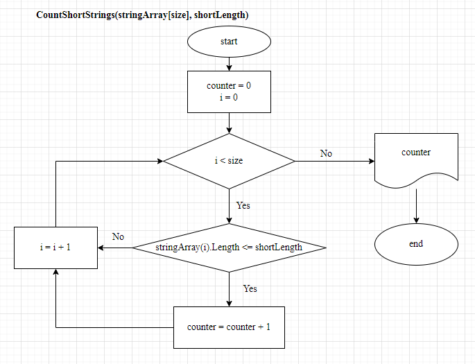

# ИТОГОВАЯ ПРОВЕРОЧНАЯ РАБОТА

**Программа:** Разработчик

**Блок 1:** Базовое знакомство с IT

**Студент:** Полошков Юрий Евгеньевич

## Задача

Написать программу, которая из имеющегося массива строк формирует массив из строк, длинна которых меньше, либо равна 3 символа.

*Первоначальный массив можно ввести с клавиатуры, либо задать на старте выполнения алгоритма. 
При решении не рекомендуется пользоваться коллекциями, лучше обойтись исключительно массивами.*

## Задания

1. Создать репозиторий на GitHub.
2. Нарисовать блок-схему алгоритма.
3. Снабдить репозиторий оформленным текстовым описанием решения (файл README.md).
4. Написать программу, решающую поставленную задачу.
5. Использовать контроль версий в работе над проектом.

## Общее описание решения и алгоритма

Решение задачи (*код программы*) осуществлено на языке **C#** без использования коллекций и динамических массивов.

Учитывая выбор языка и наложенные ограничения на использование структур данных, решение задачи реализовано в 2 прохода исходного массива:
* на первом проходе осуществляется проверка наличия и подсчет количества строк, удовлетворяющих условию отбора *(не превышающих заданную длинну - __коротких строк__)*;
* на втором продходе осуществляется выборка и формирование результирующего массива, содержащего короткие строки. 

## Реализация: блок-схема алгоритма решения задачи

**Основная  программа**

**Метод проверки наличия и подсчета количества коротких строк**

**Метод выборки и формирования массива коротких строк**

## Реализация: C# programm

_**Declaration:**_ Код программы написан без методов валидации вводимых пользователем данных, подразумевается, что у пользователя нет задачи намеренно вызвать ошибку исполнения.

Реализация программного кода состоит из 4-х методов и основного блока.

*Метод 1:* **InitialazeStringArray** - формирует исходный массив, запрашивая его параметры и элементы у пользователя.

*Метод 2:* **PrintStringArray** - выводит массив на печать.

*Метод 3:* **CountShortStrings** - подсчитывает количество коротких строк в исходном массиве.

*Метод 4:* **FilterShortStrings** - выбирает из исходного масива все коротник строки в результирующий массив.

*Основной блок программы:* Решает поставленную задачу посредством вызова указанных методов в соответствии с блок-схемой работы.